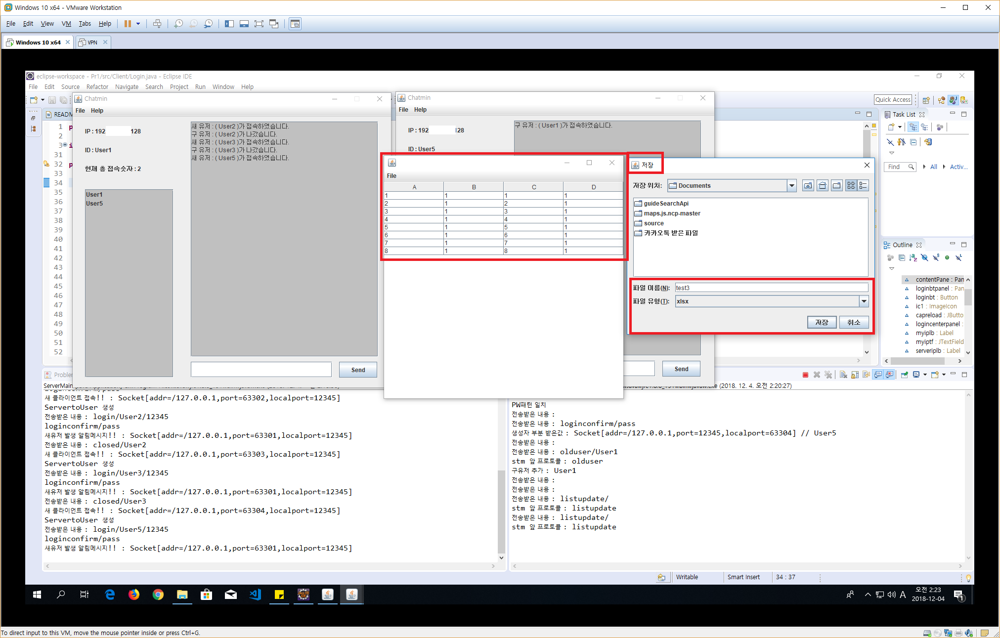
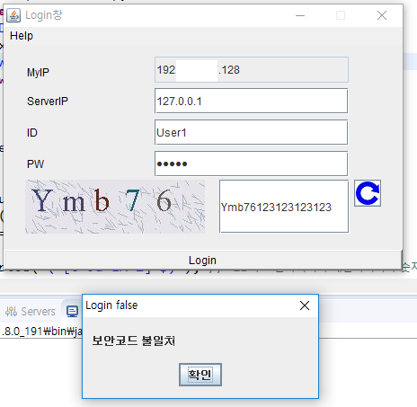
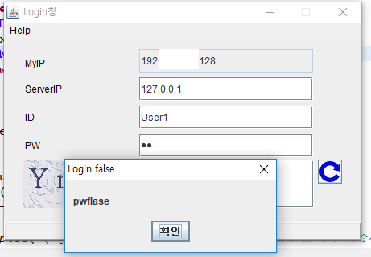
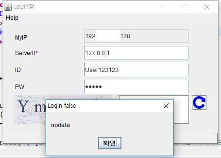

자바언어 배우고 처음으로 만든 프로그램입니다. 

현재 클라이언트 접속 버그가 존재합니다.

### 개발환경
- 이클립스
- 자바 1.8

### 특징
- 유저간 파일전송 가능 (TCP 이용)
- 유저입장, 종료시 알림
- 간단엑셀(열기, 데이터 편집, 저장)
- 로그인중복방지, 보안코드오류시 접속방지, 비밀번호 확인, 아이디존재 여부확인

### 외부라이브러리
- commons-collections4-4.1.jar
- poi-3.17.jar
- poi-ooxml-3.17.jar
- poi-ooxml-schemas-3.17.jar
- xmlbeans-2.6.0.jar

