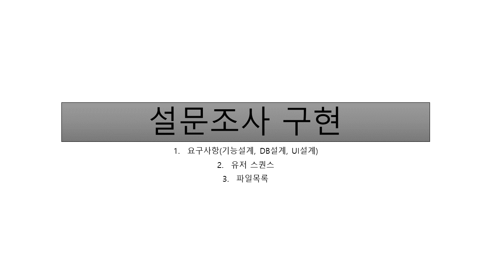
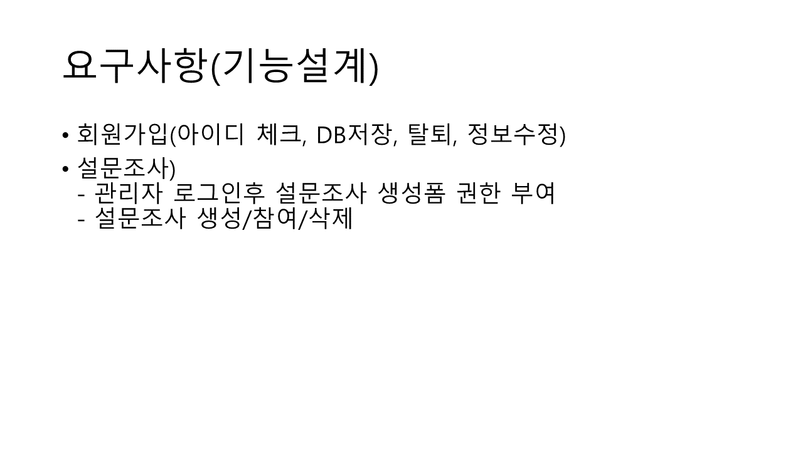
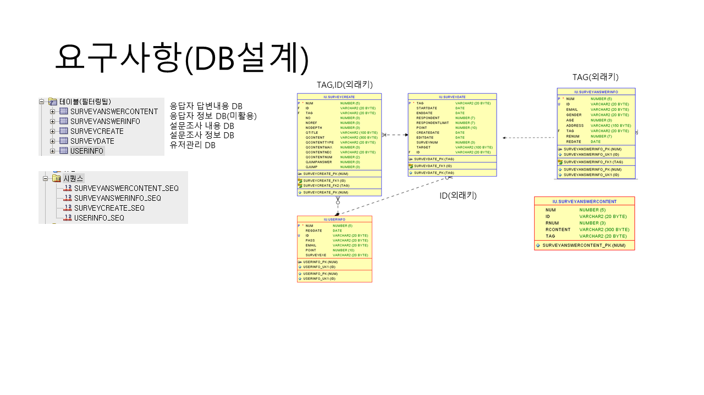
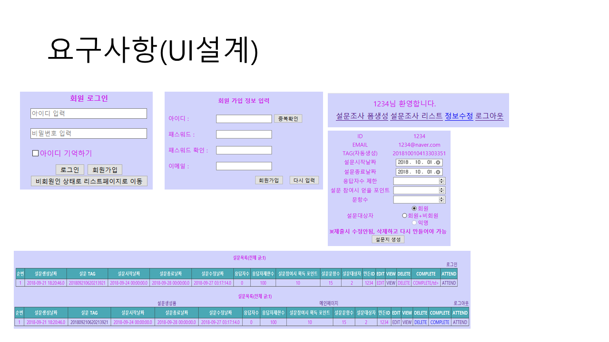
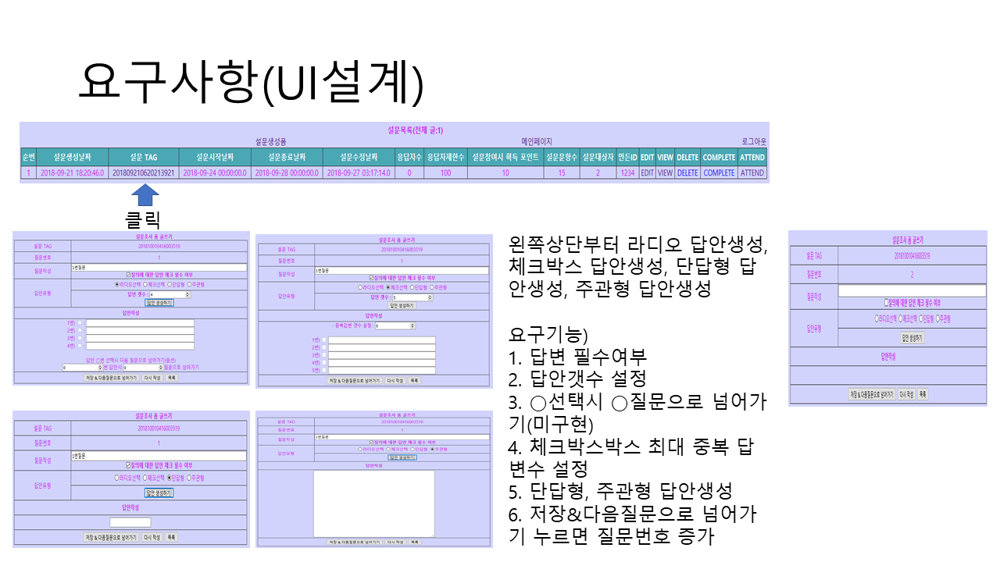
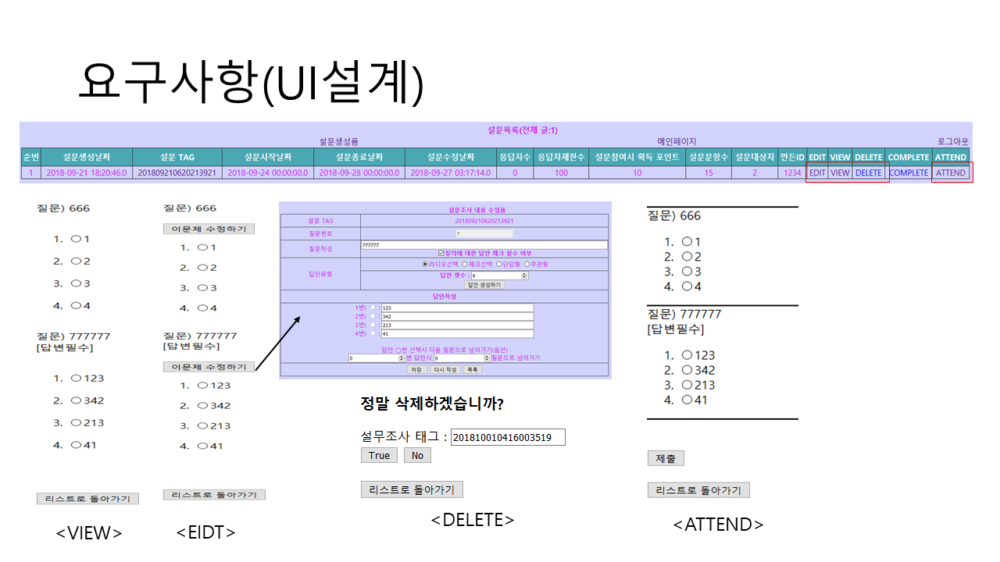
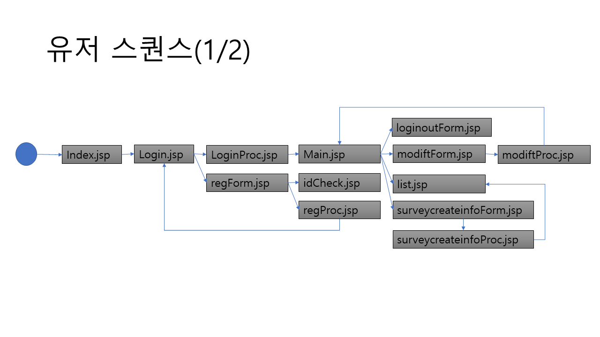
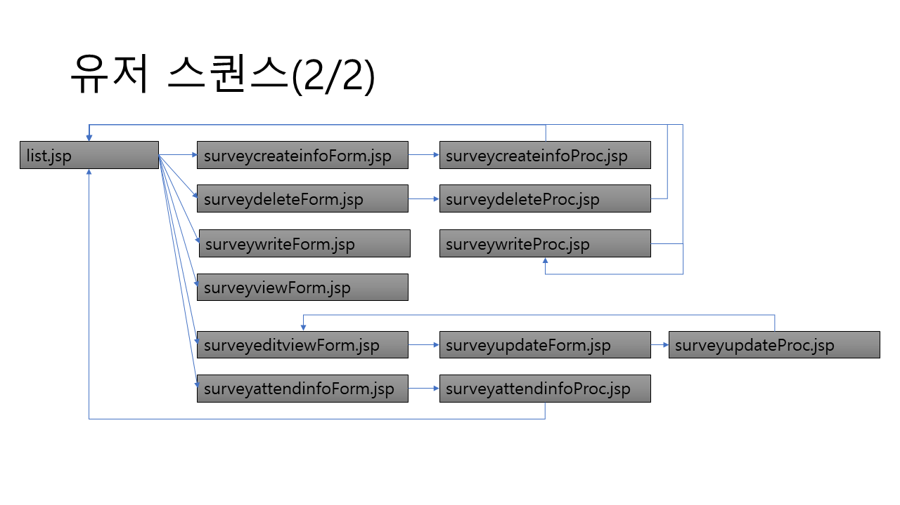
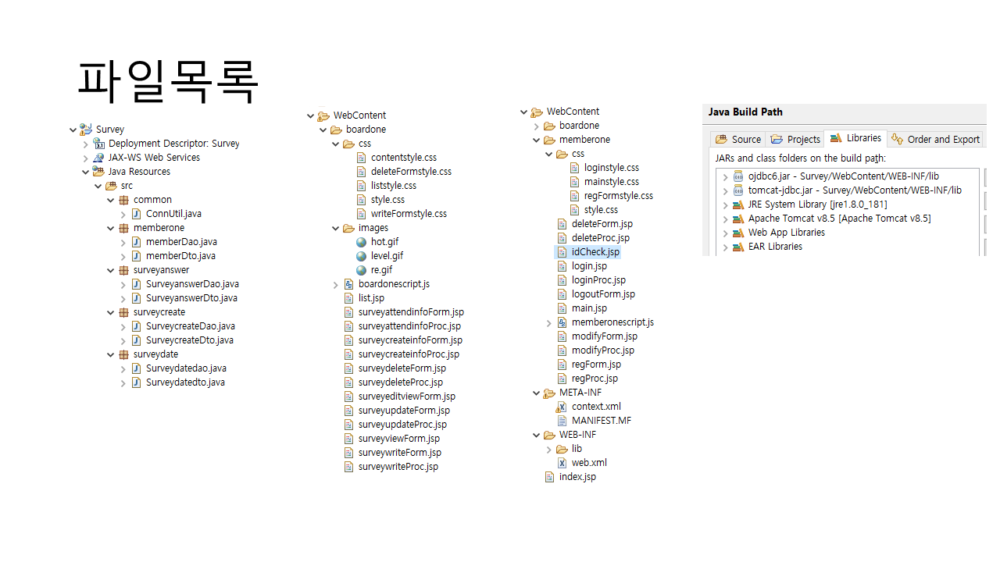
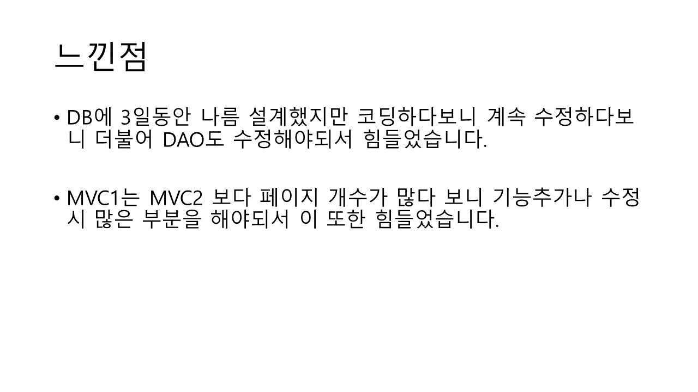

기존과제 : 간단 설문조사 만들기
개성있게 과제변경 : 설문조사폼을 만드는 사이트

### 1.개발환경
- 이클립스
- 자바 1.8
- 오라클 11
- ojdbc6.jar 라이브러리
- tomcat-jdbc.jar 라이브러리

### 2.특징
- 회원가입(아이디체크, DB저장, 탈퇴, 정보수정)
- 설문조사 생성/참여/삭제

### 3.결과

