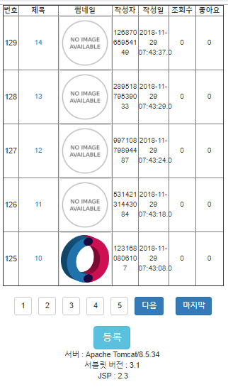
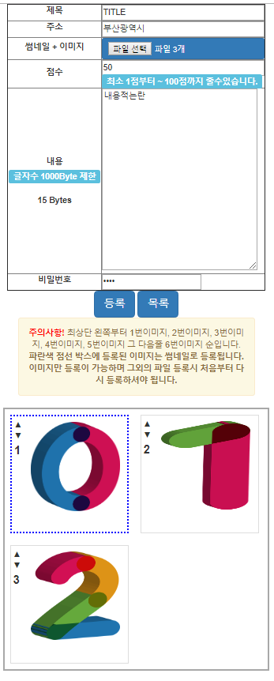
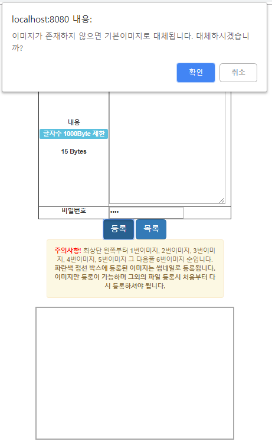
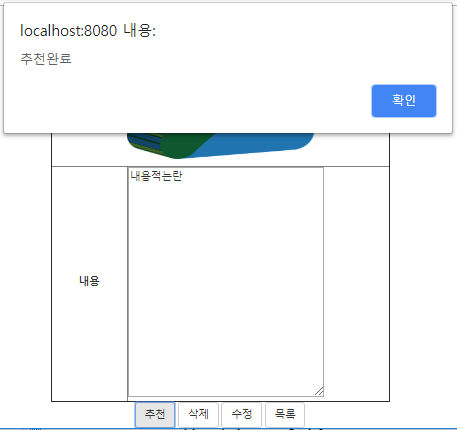
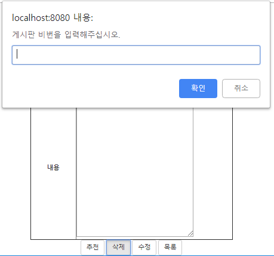
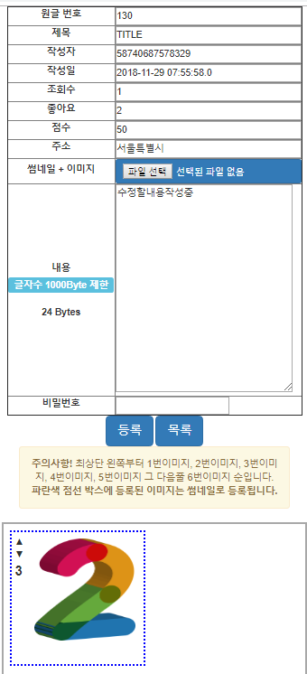
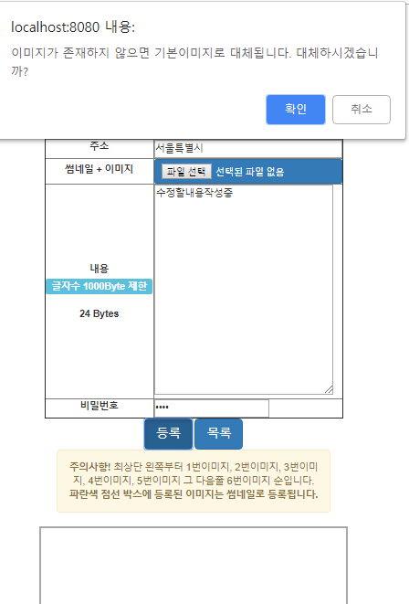

프로젝트)
## 1. 개요
- 현재 팀프로젝트 중 제가 맡은부분 코드만 올리겠습니다.
- 동작은 되나 코드가 난잡하여서 정리단계에 있습니다.

## 2.맡은 부분
- src/main/package : foodvisor.*
- src/main/resources : foodvisor/*.xml, foodvisor/config/*.xml
- src/main/webapp/resources/foodvisor : css, fonts, images, js, ico 등 정적 파일들
- WEB-INF/view/foodvisor : LIST, NEW, READ, EDIT JSP파일
- DB-foodvisor : DB CREATE 구문
- foodvisor.ucls : UML 클래스

## 3. 특징 및 버전
- MVC 패턴
- bootstrap.js / bootstrap.css
- Jquery 3.3.1
- Mybatis
- Eclipse Java EE IDE for Web Developers 4.8
- Oracle 11
- 윈도우10
- Tomcat 8.5
- 페이지 네이션
- Ajax

## 4. 결과

